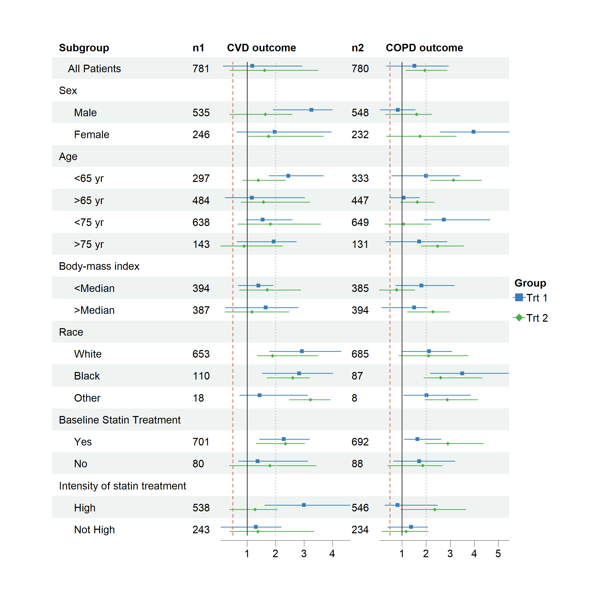
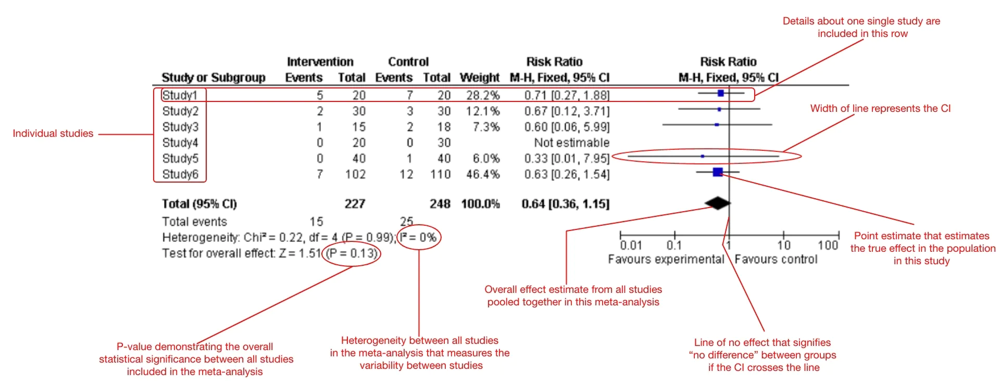

```{r echo=F,message=FALSE,warning=FALSE,comment=NA}
# Sources the R file with all the relevant setup and commands
source("assets/setup.R")

# This allows the use of panels (from 'xaringanExtra')
xaringanExtra::use_panelset()
# This allows to copy code from the slides directly
xaringanExtra::use_clipboard()
# This freezes the frame for when there's a gif included
xaringanExtra::use_freezeframe()
# This allows draw on slides.
xaringanExtra::use_scribble()
# This highlight the code
xaringanExtra::use_extra_styles(hover_code_line = TRUE, mute_unhighlighted_code = FALSE)

# Defines the path to the file with the .bib entries (in case there are references)
# bibfile=ReadBib("~/Dropbox/Perso/Office/CV/mypubs.bib",check = FALSE)
library(xaringanthemer)
style_mono_light(base_color = "#23395b")

library(forestploter)
library(grid)
library(gridExtra)

# Prepare data for demo
dt <- read.csv(system.file("extdata", "example_data.csv", package = "forestploter"))
dt <- dt[c(1:7, 10:12), ]
dt1 <- dt[1,]
dt1$est <- 1.3
dt1$low <- 1.02
dt1$hi <- 1.59
dt <- rbind(dt[2:10, ], dt1)
```


class: title-slide, center, middle

# `r rmarkdown::metadata$title``r vspace("10px")` `r rmarkdown::metadata$subtitle`

### `r rmarkdown::metadata$author`

### `r rmarkdown::metadata$institute`


.title-small[
`r icons::icon_style(icons::fontawesome("envelope",style = "solid"),scale=.8,fill="#00acee")`  [ad938@medschl.cam.ac.uk](mailto:ad938@medschl.cam.ac.uk)
`r icons::icon_style(icons::fontawesome("firefox"),scale=.8,fill="#EA7600")`  [https://alim.gitee.io/](https://alim.gitee.io/)
`r icons::icon_style(icons::fontawesome("github"),scale=.8,fill="black")`  [https://www.github.com/adayim](https://www.github.com/adayim)
`r icons::icon_style(icons::fontawesome("github"),scale=.8,fill="black")`  [https://github.com/adayim/forestploter](https://github.com/adayim/forestploter)
`r icons::icon_style(icons::fontawesome("git-alt"),scale=.8,fill="#00acee")`  [https://gitee.com/alim](https://gitee.com/alim)     
]

### `r rmarkdown::metadata$params$conference`, `r rmarkdown::metadata$params$location` 
<!-- Can also separate the various components of the extra argument 'params', eg as in 
### `r paste(rmarkdown::metadata$params, collapse=", ")`
-->

`r date`

<!-- This adds a footer (optional and with other possibilities...) -->

---

layout: true
.footer-left[
`r rmarkdown::metadata$author`
]
<!-- Can also include social media icons & hyperlinks -->
.footer-social[
<!-- `r add_email()` `r add_website()`  -->
]

<!-- Can also add a center footer, eg to include the title of the talk -->
.footer-center[

]
<!-- And a right footer, to include the date -->
.footer-right[
`r rmarkdown::metadata$params$conference`
]

---


# 森林图

- 主要用于Meta分析，但是也可以用来展示回归模型的参数估计

--

.left-column[

]

.right-column[
```{r echo=FALSE}
tmp <- read.csv(system.file("extdata", "example_data.csv", package = "forestploter"))

tmp$hr1 <- ifelse(is.na(tmp$est_gp1), "",
                 sprintf("%.2f (%.2f to %.2f)",
                         tmp$est_gp1, tmp$low_gp1, tmp$hi_gp1))
tmp$hr2 <- ifelse(is.na(tmp$est_gp2), "",
                 sprintf("%.2f (%.2f to %.2f)",
                         tmp$est_gp2, tmp$low_gp2, tmp$hi_gp2))
tmp$hr3 <- ifelse(is.na(tmp$est_gp3), "",
                 sprintf("%.2f (%.2f to %.2f)",
                         tmp$est_gp3, tmp$low_gp3, tmp$hi_gp3))
tmp$hr4 <- ifelse(is.na(tmp$est_gp4), "",
                 sprintf("%.2f (%.2f to %.2f)",
                         tmp$est_gp4, tmp$low_gp4, tmp$hi_gp4))

tmp[,c("Subgroup", "Treatment", "Placebo", 
       "hr1", "hr2", "hr3", "hr4")] |> 
  kbl() |> 
  kable_classic(font_size = 8, html_font = "Cambria")
  
```
]


---

# 森林图

.left-column[

]

.right-column[
.center[
  
]
]

---

# 森林图

.center[

]

---


# 现有其他森林图绘制包

## 现有的包
- .large[**forestplot**]：从`rmeta`包中剥离出来，目前最流行的包。只能有一列绘制置信区间。

- .large[**meta，metafor，rmeta**]：仅限于使用这些包时绘制meta分析得到的结果。

- .large[**ggforestplot**]：以`ggplot2`为基础的森林图绘制包，不灵活，未在CRAN上发布。

--

.pull-left[
## 问题
1. 需要多个列绘制森林图
2. 直接可以用于出版物的漂亮的森林图
3. 满足及其挑剔的用户需求
]
.pull-right[
.center[

]
]


---

# 问题分解

```{r blank-table, echo=FALSE, fig.show="hide"}
dfm <- dt[,c(1:8)] 

dfm$Subgroup <- ifelse(is.na(dfm$Placebo), 
                       dfm$Subgroup,
                       paste0("   ", dfm$Subgroup))
dfm$Treatment[is.na(dfm$Treatment)] <- ""
dfm$Placebo[is.na(dfm$Placebo)] <- ""
dfm$`HR (95% CI)` <- paste(rep(" ", 20), collapse = " ")
tm <- forest_theme(base_size = 10)

grid.table(dfm[,c(1:3, 9)], rows = NULL,
           theme = tm$tab_theme)
```
.center[
  `)
]

---

# 问题分解

```{r ci-table, echo=FALSE, fig.show="hide"}
forest(dfm[,c(1:3, 9)],
       est = list(dt$est_gp1,
                  dt$est),
       lower = list(dt$low_gp1,
                    dt$low), 
       upper = list(dt$hi_gp1,
                    dt$hi),
       ci_column = 4,
       ref_line = 1,
       arrow_lab = c("Favor Ctrl", "Favor Trt"),
       xlim = c(0.2, 3),
       nudge_y = 0.2,
       x_trans = "log",
       theme = tm)
```
.center[
  `)
]

---
# forestploter包

### 安装
```{r eval=FALSE}
install.packages("forestploter包")
```

### 主要函数
```{r eval=FALSE}
# Main function
forest(data, est, lower, upper, sizes, ci_column, 
       ref_line, xlim, ticks_at, arrow_lab, x_trans,
       xlab, theme, ...)

# Theme
forest_theme(ci_, legend_, xaxis_, refline_, vertline_, summary_, footnote_, title_, arrow_)
```

---
# forestploter包

### 后期处理函数
```{r eval=FALSE}
add_text(plot, text, row, col, 
         part = c("body", "header"), 
         gp = gpar(),...)

insert_text(plot, text, row, col, 
            before = TRUE,...)

add_border(plot, row, col, 
           part = c("body", "header"), 
           where = c("bottom", "left", "top", "right"), 
           gp = gpar())

edit_plot(plot, row, col, 
          part = c("body", "header"),
          which = c("text", "background", "ci"), 
          gp = gpar())
```

---

# 简单的森林图

### 数据准备
.panelset[
.panel[.panel-name[代码]
```{r }
# Data manipulation
dfm <- dt[,c(1:6)] 
# Indent groups
dfm$Subgroup <- ifelse(is.na(dfm$Placebo), 
                       dfm$Subgroup,
                       paste0("   ", dfm$Subgroup))
dfm$trt_ctrl <- paste0(dfm$Treatment, "/", dfm$Placebo)
dfm$trt_ctrl[grepl("NA", dfm$trt_ctrl)] <- ""
# Space for CI column
dfm$ci_col <- paste(rep(" ", 20), collapse = " ")

dfm$hr <- ifelse(is.na(dfm$est), "", 
                 sprintf("%.2f (%.2f to %.2f)", 
                         dfm$est, dfm$low, dfm$hi))
dfm$Treatment <- NULL
dfm$Placebo <- NULL
```
]

.panel[.panel-name[表]
```{r echo=FALSE}
dfm |> 
  kbl(row.names = FALSE) |> 
  kable_classic(full_width = F, font_size = 12)
```
]
]

---

# 简单的森林图

### 绘图
.panelset[
.panel[.panel-name[代码]

```{r simple-forest, fig.show="hide"}
fig_dt <- dfm[,c(1, 5:7)]
colnames(fig_dt)[2:4] <- c("Trt/Ctrl", rep("", 2))

p <- forest(fig_dt,
            est = dfm$est,
            lower = dfm$low, 
            upper = dfm$hi,
            is_summary = c(rep(F, 9), T),
            ci_column = 3,
            ref_line = 1,
            xlim = c(0.3, 4),
            ticks_at = c(0.5, 1, 1.5, 2.5, 3.5),
            arrow_lab = c("Better", "Worse"))
plot(p)
```
]

.panel[.panel-name[图]
.center[
`)
]
]
]

---

# 修改主题

.panelset[
.panel[.panel-name[代码]

```{r }
tm <- forest_theme(base_size = 10,
                   base_family = "serif",
                   # Confidence interval point shape, line type/color/width
                   ci_pch = 15,
                   ci_col = "#762a83",
                   ci_fill = "black",
                   ci_alpha = 0.8,
                   ci_lwd = 1.5,
                   ci_Theight = 0.2, # Set an T end at the end of CI 
                   # Reference line width/type/color
                   refline_lty = "dashed",
                   refline_col = "grey20",
                   # Summary elements
                   summary_fill = "#67a9cf",
                   # Arrow
                   arrow_type = "closed",
                   arrow_label_just = "end")
```
```{r simple-forest-theme, echo=FALSE, fig.show="hide"}
p <- forest(fig_dt,
            est = dfm$est,
            lower = dfm$low, 
            upper = dfm$hi,
            ci_column = 3,
            is_summary = c(rep(F, 9), T),
            ref_line = 1,
            xlim = c(0.3, 4),
            ticks_at = c(0.5, 1, 1.5, 2.5, 3.5),
            arrow_lab = c("Better", "Worse"),
            theme = tm)
p
```
]

.panel[.panel-name[图]
.center[
`)
]
]
]


---

# 编辑图片

.panelset[
.panel[.panel-name[代码]

```{r edit-plot, fig.show="hide"}
# Bold and change color
g <- edit_plot(p, 
               row = c(1, 2, 5, 8), 
               gp = gpar(col = "#b2182b", fontface = "bold"))

# Change color of the CI
g <- edit_plot(g,
               row = 7,
               col = 3,
               which = "ci",
               gp = gpar(col = "black", fill = "red"))

# Edit background of row 5
g <- edit_plot(g, row = 7, which = "background",
               gp = gpar(fill = "darkolivegreen1"))
plot(g)
```
]

.panel[.panel-name[图]
.center[
`)
]
]
]

---

# 添加文字

.panelset[
.panel[.panel-name[代码]

```{r edit-text, fig.show="hide"}
g <- add_text(g, "HR (95% CI)", col = 3:4, part = "header",
              gp = gpar(fontface = "bold"))

g <- insert_text(g, "Data source: This is a demo data",
                 row = 10, col = 1:2, 
                 part = "body", just = "left",
                 before = FALSE,
                 gp = gpar(fontface = "italic",
                           fontsize = 8,
                           col = "blue"))
plot(g)
```
]

.panel[.panel-name[图]
.center[
`)
]
]
]

---

# 添加边框

.panelset[
.panel[.panel-name[代码]

```{r add-border, fig.show="hide"}
g <- add_border(g, part = "header", row = 1, where = "top")
g <- add_border(g, part = "header", row = 1, where = "bottom")

g <- add_border(g, col = 1, row = 2:10,
                where = "right", 
                gp = gpar(lty = "dashed", col = "#878787"))
plot(g)
```
]

.panel[.panel-name[图]
.center[
`)
]
]
]

---

# 多组多列复杂森林图

.panelset[
.panel[.panel-name[代码]

```{r echo=FALSE}
dt <- dt[-nrow(dt), ]
dt$e1 <- ifelse(is.na(dt$Treatment), "", dt$Treatment)
dt$e2 <- ifelse(is.na(dt$Placebo), "", dt$Placebo)
dt$cvd <- paste(rep(" ", 20), collapse = " ")
dt$copd <- paste(rep(" ", 20), collapse = " ")
dt$bk <- "  "
```

```{r}
fig_dt <- dt[,c(1, 19, 21, 23, 20, 22)]
colnames(fig_dt)[2:6] <- c("N", "HR (95% CI)", "", "N", "HR (95% CI)")

tm <- forest_theme(base_size = 10, ci_pch = c(15, 18),
                   ci_fill = c("#e41a1c", "#377eb8"),
                   legend_name = "Treatment Arm",
                   legend_value = c("Trt 1", "Trt 2"))

p <- forest(fig_dt,
            est = list(dt$est_gp1, dt$est_gp2, dt$est_gp3, dt$est_gp4),   #<<
            lower = list(dt$low_gp1, dt$low_gp2, dt$low_gp3, dt$low_gp4), #<<
            upper = list(dt$hi_gp1, dt$hi_gp2, dt$hi_gp3, dt$hi_gp4),     #<<
            ci_column = c(3, 6),
            ref_line = 1, nudge_y = 0.3,
            xlim = list(c(0.5, 4), c(0, 5)),                              #<<
            ticks_at = list(c(0.5, 1, 2, 3), c(0.5, 1, 2.5)),             #<<
            theme = tm)
```

```{r multiple-group, echo=FALSE, fig.show="hide"}
g <- insert_text(p, "CVD",
                 row = 1, col = 2:3, 
                 part = "header",
                 gp = gpar(fontface = "italic"))
g <- add_text(g, "COPD",
                 row = 1, col = 5:6, 
                 part = "header",
                 gp = gpar(fontface = "italic"))
g <- add_border(g, part = "header", row = 1,
                col = 2:3,
                where = "bottom", gp = gpar(lwd = 0.5))
g <- add_border(g, part = "header", row = 1,
                col = 5:6,
                where = "bottom", gp = gpar(lwd = 0.5))
g <- add_border(g, part = "header", row = 2,
                where = "bottom", gp = gpar(lwd = 0.5))
g <- add_border(g, part = "header", row = 1,
                where = "top", gp = gpar(lwd = 0.5))
plot(g)
```


]

.panel[.panel-name[图]
.center[
`)
]
]
]


---

# 图片保存


```{r save-plot, eval=FALSE}
# Get width and height
p_wh <- get_wh(plot = p, unit = "in")

png('rplot.png', res = 300, 
    width = p_wh[1], 
    height = p_wh[2], units = "in")
p
dev.off()

```


---

# 总结

## 优点
1. 仅依赖`gtable`和`gridExtra`两个包。
2. 输出的是`gTree`对象，可以用`ggsave`输出。
3. 可以通过`forest_theme`修改森林图的所有元素，包括每个单元格的文字对齐和数学公式的支持，详见帮助文档。
4. 对图片进行后续编辑。

## 不足
* 图的生成过程涉及到图片元素空间占用的计算，无法对图进行缩放。

---

class: thankyou-barney 


